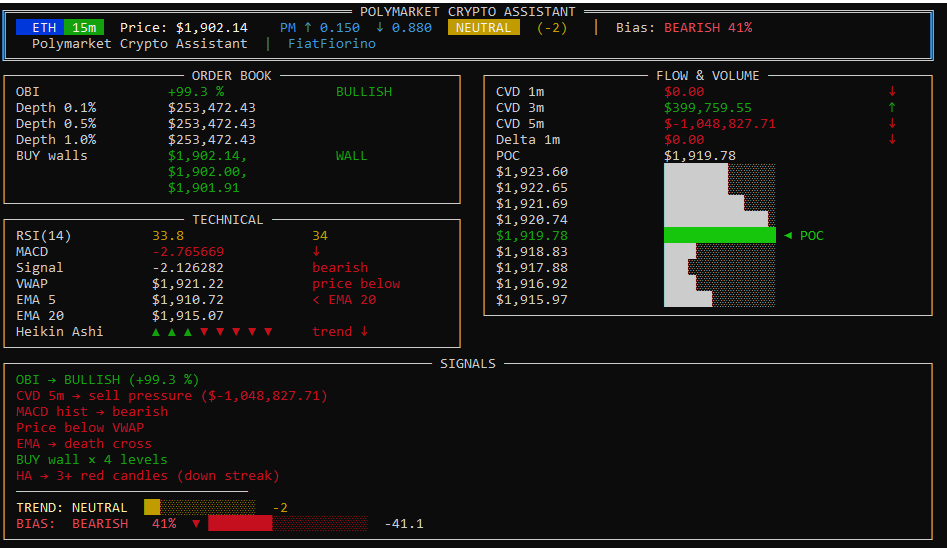
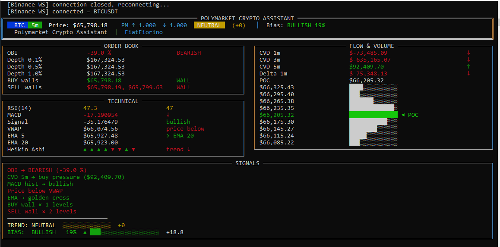

# Polymarket Crypto Assistant Tool

Real-time terminal dashboard that combines live Binance order flow with Polymarket prediction market prices to surface actionable crypto signals.

## Screenshots


---

## Setup

```bash
pip install -r requirements.txt
python main.py
```
---
## What it does

- Streams live trades and orderbook from **Binance**
- Fetches Up/Down contract prices from **Polymarket** via WebSocket
- Calculates 11 indicators across orderbook, flow, and technical analysis
- Aggregates everything into a single **BULLISH / BEARISH / NEUTRAL** trend score
- Renders the full dashboard in the terminal with live refresh
- Sends notifications to a Telegram bot about a trend change and about a strong bullish/bearish trend.
---

## Supported coins & timeframes

| Coins | Timeframes |
|-------|------------|
| BTC, ETH, SOL, XRP | 5m, 15m, 1h, 4h, daily |

All 16 coin × timeframe combinations are supported on Polymarket.

---

## Indicators

**Order Book**
- OBI (Order Book Imbalance)
- Buy / Sell Walls
- Liquidity Depth (0.1% / 0.5% / 1.0%)

**Flow & Volume**
- CVD (Cumulative Volume Delta) — 1m / 3m / 5m
- Delta (1m)
- Volume Profile with POC

**Technical Analysis**
- RSI (14)
- MACD (12/26/9) + Signal + Histogram
- VWAP
- EMA 5 / EMA 20 crossover
- Heikin Ashi candle streak

---


---


